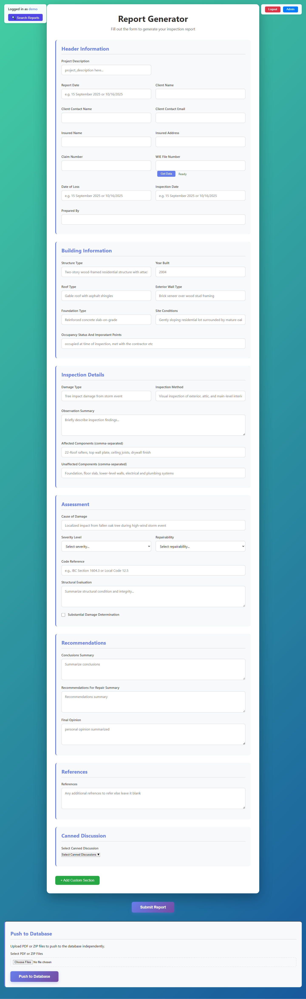
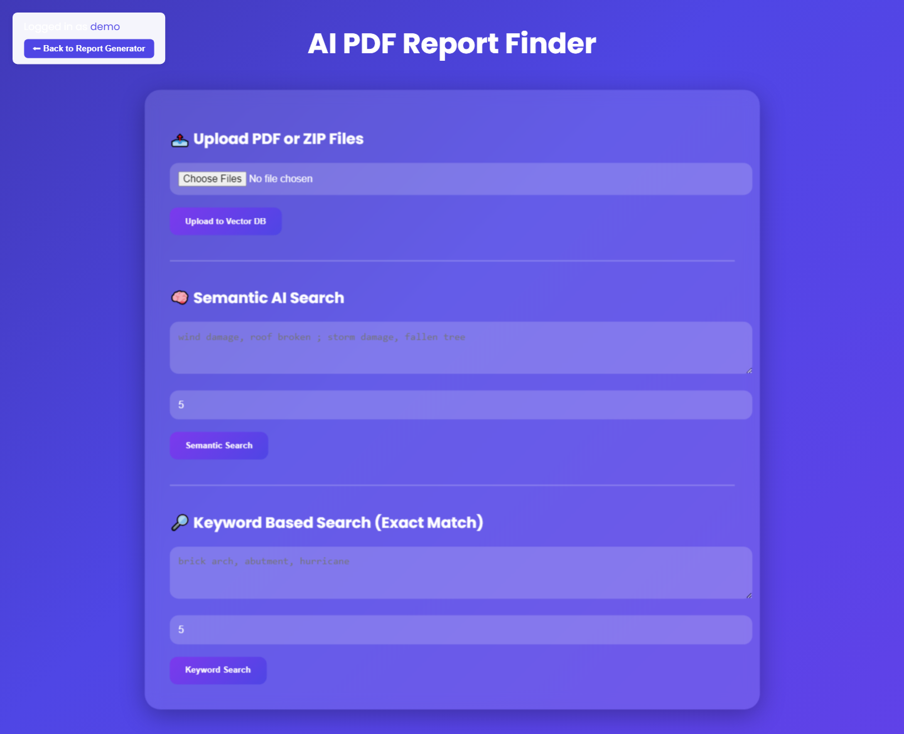
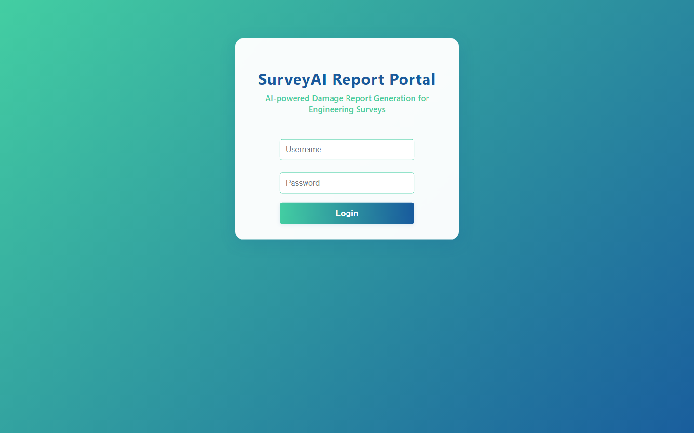
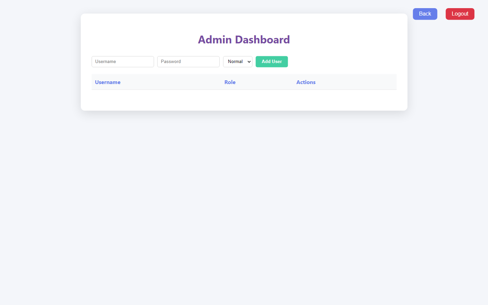

# SmartRetriever — RAG Document Search & Report Generation

> **Ask questions across all your documents and get accurate, sourced answers — plus automated reports.**

SmartRetriever is a Retrieval-Augmented Generation (RAG) platform that makes large document collections searchable, answerable, and report-ready. It combines semantic vector search with keyword search so nothing gets missed.

---

## Screenshots

A look inside the SmartRetriever RAG platform.

### AI Report Generator

*Generate structured reports from your document knowledge base — header information, building details, inspection findings, assessment, and recommendations, all assembled automatically.*

### Hybrid AI Search — Semantic + Keyword

*Upload PDFs or ZIP files to the vector database, then query with semantic AI search or exact keyword search — sourced, accurate answers across every document.*

### Secure Portal Login

*Role-based access to the document intelligence portal.*

### Admin Dashboard

*User and role management — control who can access and manage the knowledge base.*

---

## What is SmartRetriever?

**SmartRetriever is a RAG-based document retrieval and intelligence system.** It ingests your PDFs and DOCX files, indexes them for both meaning-based (vector) and exact (keyword) search, and lets you retrieve precise answers backed by the source material. It can also generate structured reports from the retrieved content.

It is built for **enterprise knowledge bases, research workflows, and any team that needs answers buried inside hundreds or thousands of documents.**

---

## Key Features

- **Hybrid search** — combines semantic vector search with keyword search for both relevance and precision.
- **Document ingestion** — processes PDF and DOCX files into a searchable knowledge base.
- **Retrieval-Augmented Generation** — answers are grounded in your actual documents, not guesses.
- **Automated report generation** — turns retrieved content into structured, templated reports.
- **Source-backed results** — answers point back to where the information came from.
- **Containerized deployment** — ships with Docker for consistent, portable setup.

---

## Who It's For

| Audience | Why SmartRetriever helps |
|----------|--------------------------|
| **Research teams** | Query large literature and document sets in plain language. |
| **Enterprise knowledge teams** | Make internal documentation actually findable. |
| **Legal & compliance** | Search contracts and policy documents with precision. |
| **Consultancies** | Generate client reports from source documents faster. |
| **Analysts** | Pull sourced facts from document piles without manual reading. |

---

## How It Works

1. **Ingest** — add your PDF and DOCX documents to the system.
2. **Index** — SmartRetriever builds vector and keyword indexes automatically.
3. **Search & ask** — query in natural language or by keyword.
4. **Retrieve** — get accurate, source-backed answers.
5. **Generate** — optionally compile the results into a structured report.

---

## Technology

- **Core:** Python
- **Search:** vector embeddings + keyword search (hybrid retrieval)
- **Documents:** PDF and DOCX processing pipeline
- **Generation:** Retrieval-Augmented Generation for grounded answers
- **Deployment:** Docker

> This repository is a **public showcase**. It documents the product — it does not contain the retrieval engine, indexing logic, or source code.

---

## Frequently Asked Questions

**What is RAG?**
Retrieval-Augmented Generation — an AI approach that retrieves relevant source material first, then generates an answer grounded in it. This reduces hallucination and makes answers traceable.

**Why hybrid search instead of just vector search?**
Vector search captures meaning; keyword search captures exact terms (names, codes, IDs). Combining both gives you relevance *and* precision.

**What documents can it process?**
PDF and DOCX files.

**Are answers traceable to sources?**
Yes. Retrieved results are grounded in your actual documents.

**Can it generate reports?**
Yes. SmartRetriever can compile retrieved content into structured, templated reports.

**Is this open source?**
No. This repository is a marketing showcase. The product is proprietary — see the license.

**How do I get a demo?**
See the **Contact** section below.

---

## Why SmartRetriever

- 🎯 **Accurate** — grounded answers, not hallucinations.
- 🔍 **Thorough** — hybrid search means nothing slips through.
- 📄 **Productive** — from question to finished report in one workflow.
- 📦 **Portable** — Docker-based, runs consistently anywhere.

---

## Contact & Demo

Interested in deploying SmartRetriever for your document collection?

- **GitHub:** [@maaz-gobi](https://github.com/maaz-gobi)
- **Inquiries:** open an issue in this repository, or reach out via GitHub.

We help organizations turn document archives into searchable, answerable knowledge bases.

---

## License

This is a proprietary product. This repository contains documentation and marketing materials only. See [LICENSE](LICENSE) for terms.

---

**Keywords:** RAG, retrieval augmented generation, AI document search, vector search, semantic search, knowledge base AI, PDF search, DOCX search, document intelligence, enterprise search, hybrid search, automated report generation, AI question answering, document retrieval system.
